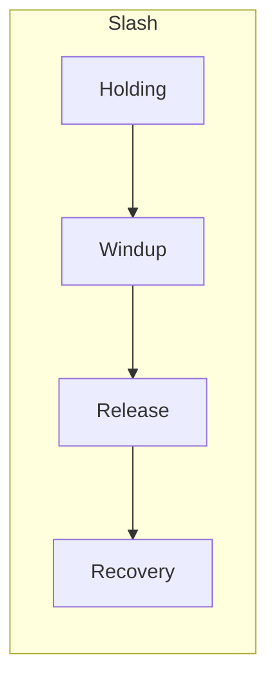
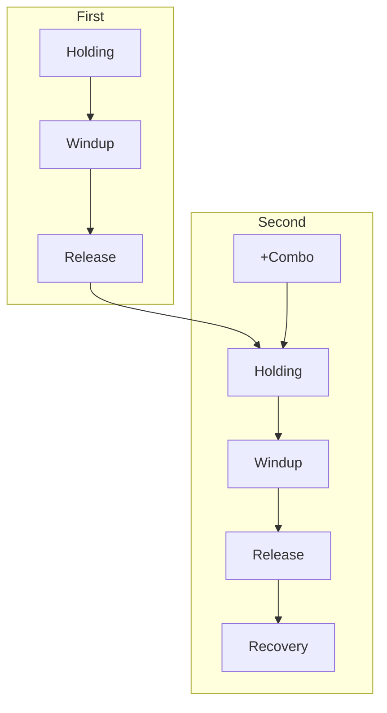
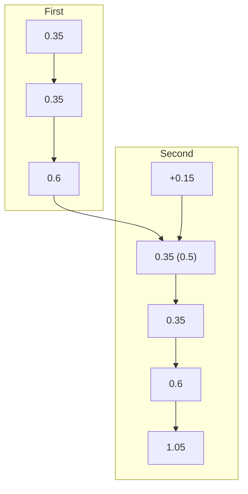

## Example Datum (Warhammer Slash)
```json
[
"holding": 0.35,
"windup": 0.2,
"release": 0.5,
"recovery": 0.9,
"combo": 0.225,
"riposte": 0.15,
"feint": 0.175,
"thwack": 1.1,
"hitsuccess": -1.0,
"blocked": 0.75,
"worldhit": -1.0,
"damage": 45.0,
"staminacost": 0.0,
"playrate": 1.0,
"drawstrength": -1.0,
"worldhitstartpercentage": -1.0,
"worldhitstoppercentage": -1.0,
"turnlimitstrength": 47.5,
"verticalturnlimitstrength": 50.0,
"reverseturnlimitstrength": 50.0,
"thwackonhit": 1,
"hitsuccessonhit": -1,
"direction": "-1",
"altdirection": "-1",
"cooldown": 0.0,
"weapontipcheckreverse": -1,
"weapontipcheckreversealt": -1,
"weapontipcheckdisable": -1,
"combofromblocked": -1.0
]
```

# Attack Phases

## Normal attack



## Combo slash slash



## Halberd Slash example

```json
"holding": 0.35,
"windup": 0.35,
"release": 0.6,
"recovery": 1.05,
"combo": 0.15,
```



